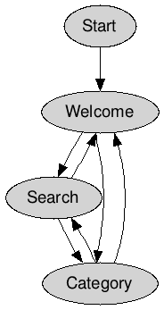

# Daily Quotation Project
## User Interface Design / Functional Specifications for Quotations project
### Introduction

The Daily Qiotation Project is an Android app that displays famous (or infamous) quotes. 
The users can select one or more categories from the quote database, and can also perform searches in the database based on a key word.

### Views and Navigation

The app consists of the following views
* Start / Splashscreen
* Welcome / Homepage
* Categories
* Search

The diagram below shows the user navigation between views:

#### Start / Splashscreen

* Proposal 1-A:

The splashscreen shows a funny logo with a quote "bubble". An actual quote can be printed within the bubble. User taps the screen to dismiss the splashscreen and enter the Welcome view.

* Proposal 1-B:

Upon starting the application for the first time a static logo splash screen appears for about one second. 

